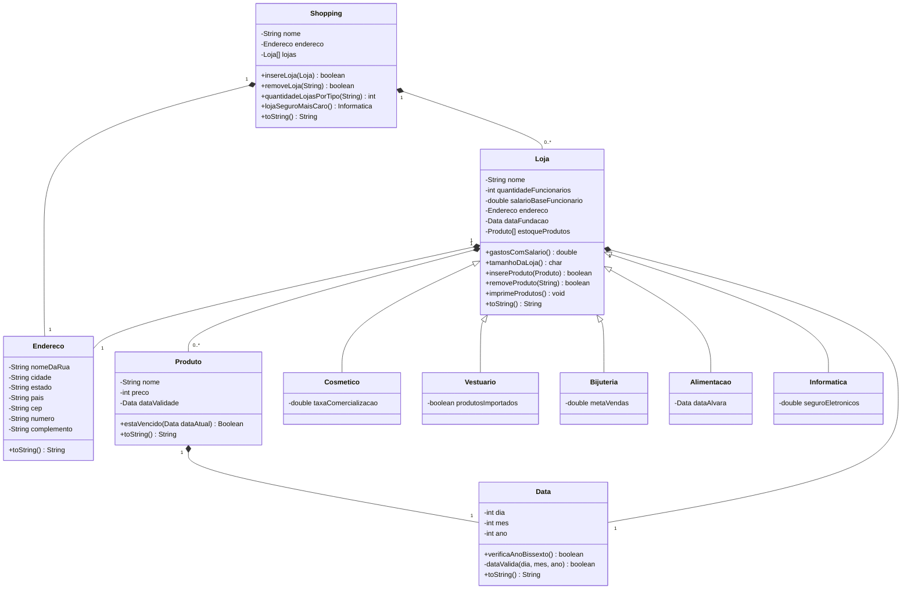

# Sistema de Gerenciamento de Shopping — Desafio Java (POO)
 
Desafio da disciplina de Laboratório I, do curso de Análise e Desenvolvimento de Sistemas, com foco em Programação Orientada a Objetos em Java. O sistema simula o cadastro e gerenciamento de um shopping center, suas lojas e produtos. O repositório está na Etapa 4 do desafio, que já aplica herança, polimorfismo, encapsulamento, sobrecarga de construtores e composição de objetos.
 
## Sobre o projeto
 
O sistema modela um `Shopping`, que possui várias `Loja`s, cada uma com um `Endereco`, uma data de fundação e um estoque de `Produto`s. As lojas são especializadas por segmento (Cosmético, Vestuário, Bijuteria, Alimentação e Informática), cada uma com atributos próprios, todas herdando de uma classe base comum `Loja`.
 
O projeto tem duas formas de execução:
 
- `Principal`: cadastro interativo via `Scanner`, com menu no console.
- `ValidadorEtapa4`: classe que instancia e testa todos os métodos das classes, imprimindo `[OK]`/`[NOK]` no console. Funciona como uma suíte de testes manual do desafio.
## Modelagem das classes
 

 
### Descrição das classes
 
| Classe | Responsabilidade |
|---|---|
| `Endereco` | Representa o endereço completo (rua, número, complemento, cidade, estado, país e CEP) de uma loja ou shopping. |
| `Data` | Representa uma data (dia/mês/ano) com validação de datas inválidas e verificação de ano bissexto. |
| `Produto` | Representa um produto do estoque, com nome, preço e data de validade, incluindo verificação de vencimento. |
| `Loja` | Classe base (superclasse) com os dados comuns a qualquer loja: nome, funcionários, salário-base, endereço, data de fundação e estoque de produtos (array de tamanho fixo). Possui um construtor alternativo em que o salário-base não é informado (assume `-1` como "não definido"). |
| `Cosmetico` | Especialização de `Loja` com taxa de comercialização. |
| `Vestuario` | Especialização de `Loja` com indicador de produtos importados. |
| `Bijuteria` | Especialização de `Loja` com meta de vendas. |
| `Alimentacao` | Especialização de `Loja` com data do alvará sanitário. |
| `Informatica` | Especialização de `Loja` com valor do seguro de eletrônicos. |
| `Shopping` | Agrega várias lojas (array de tamanho fixo), permitindo inserir, remover, contar lojas por tipo e localizar a loja de informática com o seguro mais caro. |
| `Principal` | Ponto de entrada interativo (menu via `Scanner`) para cadastrar lojas e produtos. |
| `ValidadorEtapa4` | Bateria de testes manuais que instancia e exercita todos os métodos das classes, reportando `[OK]`/`[NOK]` no console. |
 
## Regras de negócio implementadas
 
- Datas inválidas (dia/mês fora do intervalo, considerando ano bissexto) recebem automaticamente o valor padrão `01/01/2000`.
- Se a loja for criada sem informar o salário-base, ele assume `-1` e é exibido como `"Não definido"`; nesse caso, `gastosComSalario()` também retorna `-1`.
- `tamanhoDaLoja()` classifica a loja por número de funcionários: `P` até 9, `M` de 10 a 30, `G` acima de 30.
- `insereProduto` e `insereLoja` retornam `false` quando não há espaço disponível no array (capacidade fixa definida na criação).
- `estaVencido` compara a data de validade do produto com uma data de referência (ano, depois mês, depois dia).
- `lojaSeguroMaisCaro` percorre as lojas do tipo `Informatica` e retorna a que tem o maior valor de seguro de eletrônicos.
## Estrutura do projeto
 
```
Etapa_4/
└── Desafio/
    ├── Principal.java         # Menu interativo (cadastro de lojas e produtos)
    ├── ValidadorEtapa4.java   # Suíte de testes manuais de todas as classes
    ├── Shopping.java
    ├── Loja.java
    ├── Cosmetico.java
    ├── Vestuario.java
    ├── Bijuteria.java
    ├── Alimentacao.java
    ├── Informatica.java
    ├── Produto.java
    ├── Endereco.java
    └── Data.java
```
 
## Como executar
 
Requer JDK 8 ou superior.
 
```bash
# a partir da pasta Etapa_4
javac Desafio/*.java
 
# menu interativo
java Desafio.Principal
 
# suíte de validação/testes
java Desafio.ValidadorEtapa4
```
 
## Tecnologias
 
- Java (herança, polimorfismo, encapsulamento, composição, sobrecarga de construtores)
- Entrada de dados via `java.util.Scanner`
## Contexto acadêmico
 
Repositório desenvolvido para o desafio da disciplina de Laboratório I, do curso de Análise e Desenvolvimento de Sistemas, com foco em herança e composição a partir da modelagem de um domínio real (shopping, lojas e produtos).
 
## Licença
 
Projeto de fins educacionais/acadêmicos.
